  ## 목차
  - [1️⃣ 프로젝트 개요](#1%EF%B8%8F⃣-프로젝트-개요)
  - [2️⃣ 기술 스택](#2%EF%B8%8F⃣-기술-스택)
  - [3️⃣ 주요 기능 및 화면](#3%EF%B8%8F⃣-주요-기능-및-화면)
  - [4️⃣ 시스템 아키텍처](#4%EF%B8%8F⃣-시스템-아키텍처)
  - [5️⃣ 데이터베이스 설계](#5%EF%B8%8F⃣-데이터베이스-설계)
  - [6️⃣ API 엔드포인트 목록](#6%EF%B8%8F⃣-api-엔드포인트-목록)
  - [7️⃣ 모니터링 구축](#7%EF%B8%8F⃣-모니터링-구축)
  - [8️⃣ 트러블 슈팅](#8%EF%B8%8F⃣-트러블-슈팅)
  - [9️⃣ 회고](#9%EF%B8%8F⃣-회고)

   

  ## 1️⃣ 프로젝트 개요
  

    
    
  # Snowball Stock
  > 가치투자를 위한 기업 정보 제공 서비스 (개발 기간: 3개월)
    
  서비스 운영 비용상의 문제로 서비스를 중단
  

  ### 핵심 기능
  - 기업 재무정보 및 주가 정보 제공
  - 관심 종목 등록 및 알림 서비스
  - 기업 공시 정보 알림
  - ROE 기반 기업 스크리닝 및 가치평가 시스템 구현

  ### 프로젝트 특징
  - 1인 풀스택 개발 (프론트엔드/백엔드/인프라)
  - ['눈덩이 주식투자'](https://www.yes24.com/Product/Goods/7498176?Acode=101) 도서 기반 가치투자 시스템 구현
  - 자동화된 데이터 수집 및 모니터링 시스템
  - 프론트엔드 깃허브 주소: https://github.com/JMsuper/nextjs-finance-web

   

  ## 2️⃣ 기술 스택

  | 분야 | 세부 항목 |  |
  |------|-----------|-----------|
  | **Frontend** | • Next.js 13.4.3 • TypeScript 5.0.4 • React 18.2.0 | • MUI 5.x • Recoil 0.7.7 • Vercel |
  | **Backend** | • Java 17 • Spring Boot 3.2.2 • JPA/Hibernate | • Spring Security 3.2.2 • Redis • Actuator 3.2.3 |
  | **Infrastructure** | • AWS EC2(Ubuntu 22.04) • AWS RDS MySQL 8.0 • Docker 27.4.1 • Node Exporter | • AWS VPC • AWS Route 53 • Nginx • Prometheus & Grafana |

   

  ## 3️⃣ 주요 기능 및 화면

  ### 1. 주가 정보 수집 및 기업 검색
  - KRX 웹사이트 크롤링으로 10분 간격 주가 데이터 수집
  - 공공데이터 포털 API 연동으로 일 1회 상장/상폐 정보 갱신
  - Nginx, Redis 캐싱으로 API 응답 속도 최적화

  

  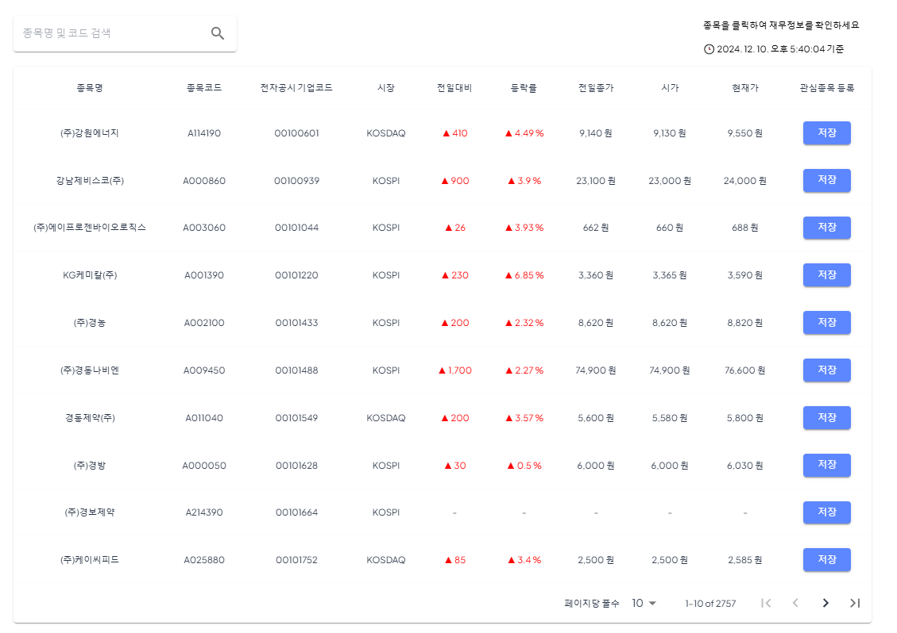
  
💡 종목명 또는 종목코드로 상장사를 검색하고 실시간 주가 정보 확인

    
  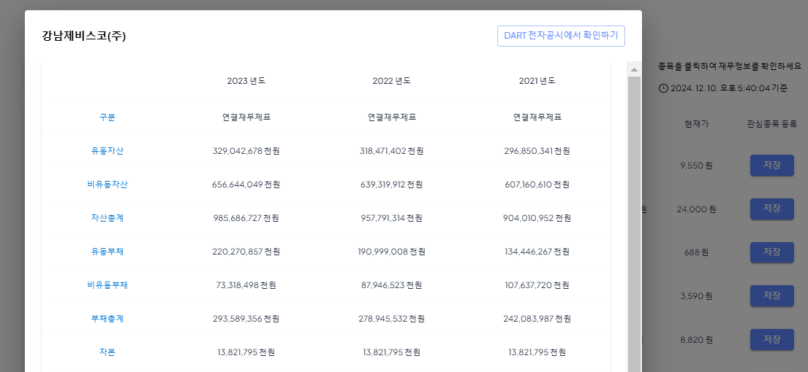
  
💡 검색된 기업의 재무제표 및 주요 투자 지표 제공

  

  ### 2. ROE 기반 기업 가치평가 시스템
  - 전자공시 DART API를 활용한 재무제표 자동 수집
  - ROE 기준 기업 가치평가 및 스크리닝 시스템 구현

  

  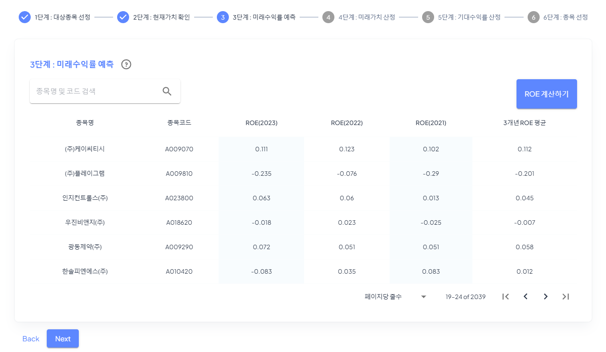
  
💡 ROE 기반의 가치평가를 통해 기업 필터링

    
  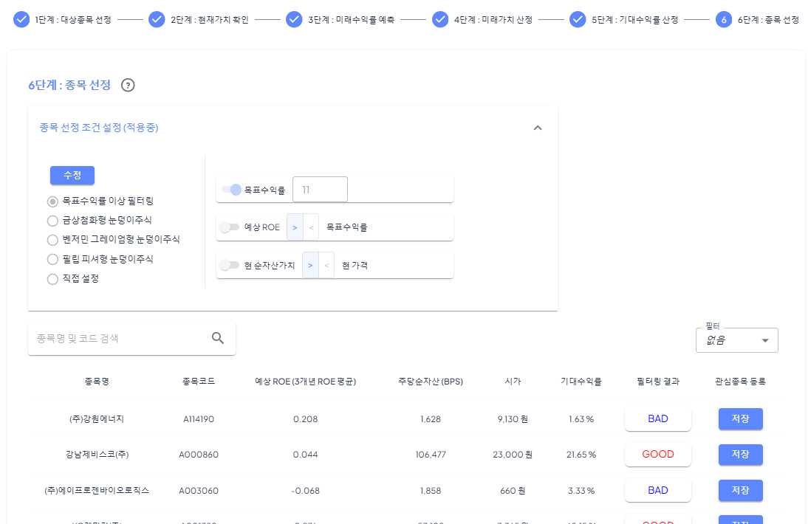
  
💡 스크리닝된 기업들의 상세 재무지표 확인 및 기대수익률 분석

  

  ### 3. 실시간 알림 서비스
  - 스케줄러를 통한 `정기주가` & `목표주가` & `기업공시` 알림
  - 이메일 알림 및 투자 부가정보 제공

  

  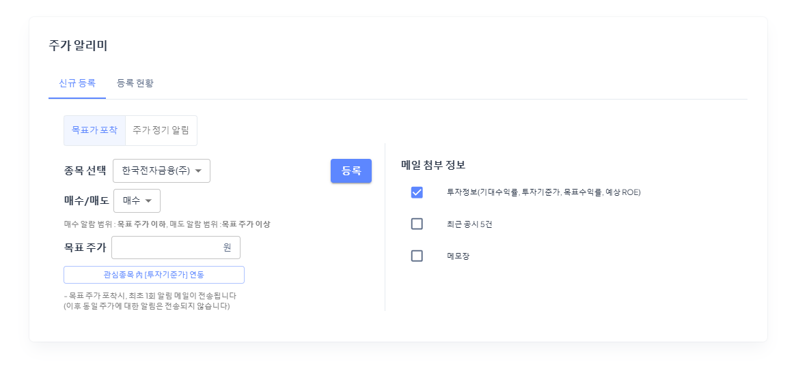
  
💡 목표가 설정 및 실시간 알림 서비스

    
  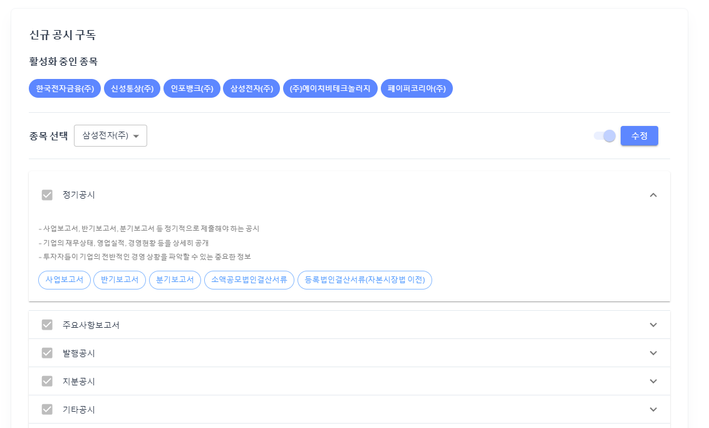
  
💡 기업별 맞춤 공시 정보 구독 설정

    
  
  
💡 이메일 알림 및 상세 정보 바로가기 제공

  

  ### 4. 관심 종목 관리
  - 관심 종목에 대한 목표수익률 & 예상 ROE 변경가능
  - 알림 설정 현황 및 이력 관리

  

  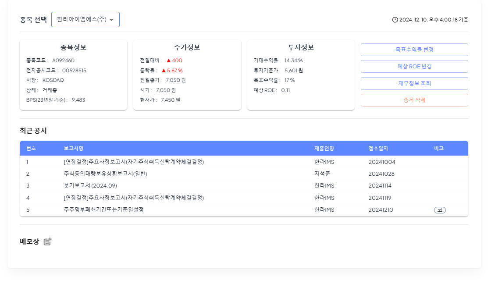
  
💡 관심 종목 등록 및 투자지표 설정

    
  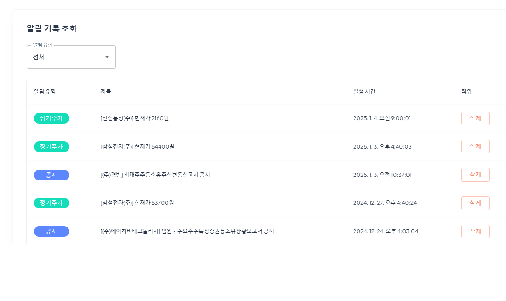
  
💡 알림 이력 조회 및 설정별 발송 현황 확인

  

   

  ## 4️⃣ 시스템 아키텍처
  ### 시스템 구성도
  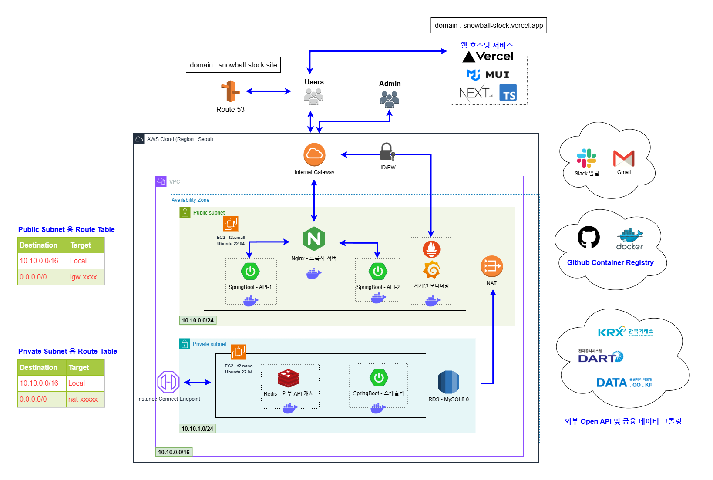

  ### 아키텍처 설계 의도

  #### 보안 강화
  - **네트워크 분리**
    - Public/Private 서브넷 분리로 보안 계층화
    - Private 서브넷의 RDB, Redis, 스케줄링 서버 보호
  - **NAT 게이트웨이**
    - Private 서브넷의 안전한 외부 통신 지원
    - 내부 리소스 보호와 동시에 필요한 외부 통신 허용
  - **안전한 SSH 접속**
    - AWS Instance Connect Endpoint 활용
    - Private 서브넷 EC2 인스턴스에 대한 보안적인 SSH 접속
    - Bastion 호스트 없이 안전한 원격 접속 구현

  #### 가용성 확보
  - **API 서버 이중화**
    - Active-Active 구성의 다중 서버 운영
    - IP Hash 기반 로드밸런싱으로 세션 일관성 보장
    - 동일 사용자의 요청을 동일 서버로 라우팅
  - **모니터링 체계**
    - Prometheus & Grafana를 통한 실시간 시스템 모니터링
    - 장애 상황 조기 감지 및 대응

  #### 개발 효율성
  - **프론트엔드 배포**
    - Vercel을 활용한 프론트엔드 배포 자동화
    - 백엔드 개발에 리소스 집중
  - **컨테이너 관리**
    - GitHub Container Registry 활용
    - 도커 이미지 관리 비용 절감

   

  ## 5️⃣ 데이터베이스 설계
  ### ERD
  

    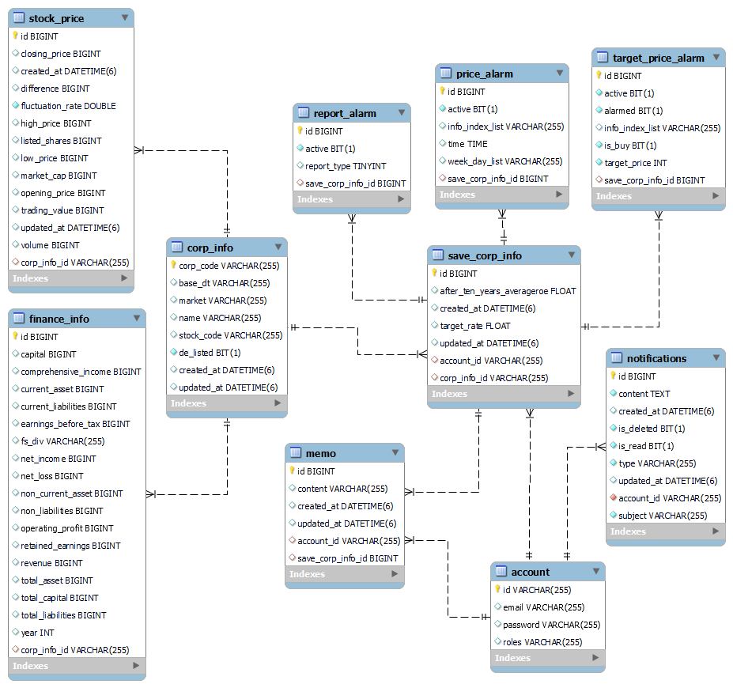
  

   

  ## 6️⃣ API 엔드포인트 목록

  > Base URL: `/api/v1`

  

  
인증 (Authentication)

  | Method | Endpoint | 설명 |
  |--------|----------|------|
  | POST | `/auth/login` | 로그인 |
  | POST | `/auth/logout` | 로그아웃 |
  | POST | `/auth/register` | 회원가입 |
  | POST | `/auth/auto-login` | 자동 로그인 |
  

  

  
알림 (Notification)

  | Method | Endpoint | 설명 |
  |--------|----------|------|
  | GET | `/alarms/target-prices` | 목표가 포착 알람 조회 |
  | GET | `/alarms/prices` | 정기 주가 알람 조회 |
  | GET | `/alarms/reports` | 신규 공시 구독 현황 조회 |
  | GET | `/notifications` | 알림 이력 전체 조회 |
  | DELETE | `/notifications/{notificationId}` | 특정 알림 삭제 |
  

  

  
재무 정보 (Finance)

  | Method | Endpoint | 설명 |
  |--------|----------|------|
  | GET | `/finances/screening` | 스크리닝 데이터 조회 |
  | GET | `/finances/stocks` | 기업 정보 및 주가 조회 |
  | GET | `/finances/{corpCode}` | 단일 기업 재무정보 조회 |
  | GET | `/finances/{corpCode}/reports` | 단일 기업 공시 조회 |
  

  

  
사용자 관리 (User)

  | Method | Endpoint | 설명 |
  |--------|----------|------|
  | PUT | `/users/{userId}/password` | 비밀번호 수정 |
  | PUT | `/users/{userId}/email` | 이메일 수정 |
  

  

  
관심 종목 (Saved Corp)

  | Method | Endpoint | 설명 |
  |--------|----------|------|
  | GET | `/users/{userId}/saved-corps` | 관심 종목 조회 |
  | POST | `/users/{userId}/saved-corps/{corpCode}` | 관심 종목 저장 |
  | PUT | `/users/{userId}/saved-corps/{corpCode}` | 관심 종목 정보 수정 |
  | DELETE | `/users/{userId}/saved-corps/{corpCode}` | 관심 종목 삭제 |
  

  

  
메모 (Memo)

  | Method | Endpoint | 설명 |
  |--------|----------|------|
  | POST | `/memos` | 메모 생성 |
  | PUT | `/memos/{memoId}` | 메모 수정 |
  | DELETE | `/memos/{memoId}` | 메모 삭제 |
  

   

## 7️⃣ 모니터링 구축
> 모니터링 URL: http://snowball-stock.site:3000

> ID: test123, PW: 123123

모니터링 대시보드

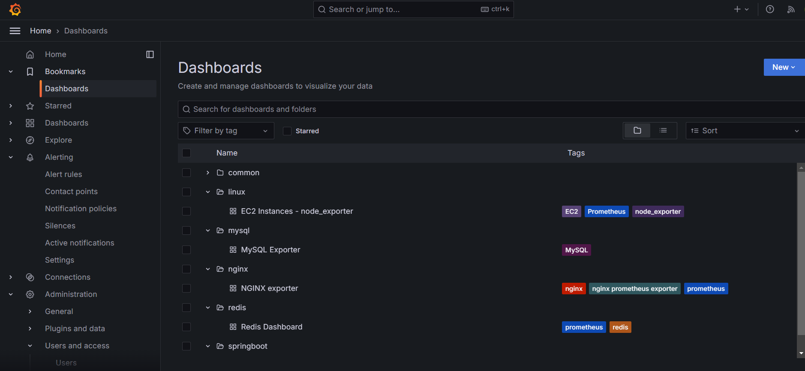

메인 대시보드

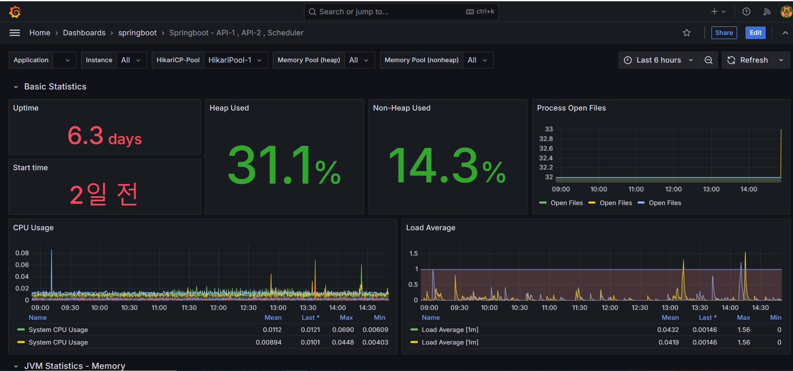

springboot 대시보드

모니터링 세부 스택

#### 메트릭 수집 도구
| 서비스 | 이미지(Docker Hub) | 버전 |
|--------|--------|------|
| Prometheus | prom/prometheus | latest |
| Grafana | grafana/grafana | latest |

#### 애플리케이션 모니터링
| 서비스 | 라이브러리 | 버전 |
|--------|------------|------|
| Spring Boot Actuator | org.springframework.boot:spring-boot-starter-actuator | 3.2.3 |
| Prometheus Registry | io.micrometer:micrometer-registry-prometheus | - |

#### 인프라 모니터링
| 서비스 | Exporter(Docker Hub) | 버전 |
|--------|-----------|------|
| Nginx | nginx/nginx-prometheus-exporter | latest |
| Redis | oliver006/redis_exporter | latest |
| MySQL | prom/mysqld-exporter | latest |
| EC2 | quay.io/prometheus/node-exporter | latest |

모니터링 알림 등록사항

| 서비스 | 모니터링 항목 | 임계값 | 알림 조건 |
|--------|--------------|--------|-----------|
| Spring | 응답 시간 | 1000ms | 초과 시 |
| Spring | JVM 힙 메모리 | 80% | 사용률 초과 시 |
| NGINX | 요청 처리율 | -30% | 평소 대비 감소율 초과 시 |
| Redis | 키 히트율 | 50% | 미만으로 떨어질 시 |
| MySQL | 쿼리 실행 시간 | 10초 | 초과 시 |
| MySQL | 활성 연결 수 | 80% | 최대 연결 수 대비 초과 시 |
| EC2 | CPU 사용률 | 90% | 초과 시 |
| EC2 | 디스크 사용률 | 80% | 초과 시 |
| EC2 | 메모리 사용률 | 90% | 초과 시 |
| EC2 | 네트워크 트래픽 | +50% | 평소 대비 증가율 초과 시 |

   

## 8️⃣ 트러블 슈팅

1. Nginx API 캐싱을 통한 응답 성능 개선 (#20)

- 문제: API 응답 속도가 느린 문제(909ms)발생 [(관련이슈)](https://github.com/JMsuper/java-bondtypestock-investment-strategy/issues/20)
- 해결: 
  - Nginx에서 API 응답을 캐싱하여 성능 개선
  - 캐시 갱신은 HTTP 헤더의 `Cache-Control` 헤더를 통해 설정
- 결과: API 응답 시간 단축(46ms)

2. 배치 작업 성능 개선 (#14)

- 문제: 외부 API 호출과 DB 업데이트 작업이 22초 소요되어 스케줄링 지연 발생 [(관련이슈)](https://github.com/JMsuper/java-bondtypestock-investment-strategy/issues/14)
- 해결: 
  - 외부 API 호출 메서드를 비동기로 전환
  - UPDATE 쿼리를 배치 쿼리로 변경
- 결과: 작업 소요시간 22초 → 3초로 단축

3. OpenDart API 호출 구조 개선(#1)

- 문제: 외부 API 호출 코드의 구조적 문제 [(관련이슈)](https://github.com/JMsuper/java-bondtypestock-investment-strategy/issues/1)
- 해결: [opendart 오픈소스](https://github.com/josw123/dart-fss)를 참고하여 공통 API 사용하도록 [모듈 구조 개선](https://github.com/JMsuper/java-bondtypestock-investment-strategy/blob/main/adam/src/main/java/com/finance/adam/openapi/dart/OpenDartUtil.java)
- 결과: 코드 재사용성 및 유지보수성 향상 [(관련 커밋)](https://github.com/JMsuper/java-bondtypestock-investment-strategy/commit/dc0f4bce49acc7965e595d609af9fa4aae8a3185)

4. 기업공시 데이터 응답 속도 개선 (#10)

- 문제: 전자공시 API 호출로 인한 3초의 응답 지연 [(관련이슈)](https://github.com/JMsuper/java-bondtypestock-investment-strategy/issues/10)
- 해결: 
  - Redis 도입
  - 기업공시 데이터 DTO 객체를 직렬화하여 캐싱 [(관련 커밋)](https://github.com/JMsuper/java-bondtypestock-investment-strategy/commit/1520d356cf43a2b91980baca2318de43140604d0)
- 결과: API 응답 속도 개선

5. AWS 네트워크 비용 최적화 (#27)

- 문제: Private 서브넷에서 Public 서브넷의 Nginx 통신 시 불필요한 NAT 게이트웨이 경유 [(관련이슈)](https://github.com/JMsuper/java-bondtypestock-investment-strategy/issues/27)
- 해결: Private 서브넷 도커 컨테이너의 /etc/hosts에 로컬 DNS 정보 등록
- 결과: 불필요한 NAT 게이트웨이 통신 제거로 네트워크 비용 절감

   

## 9️⃣ 회고
작성중
