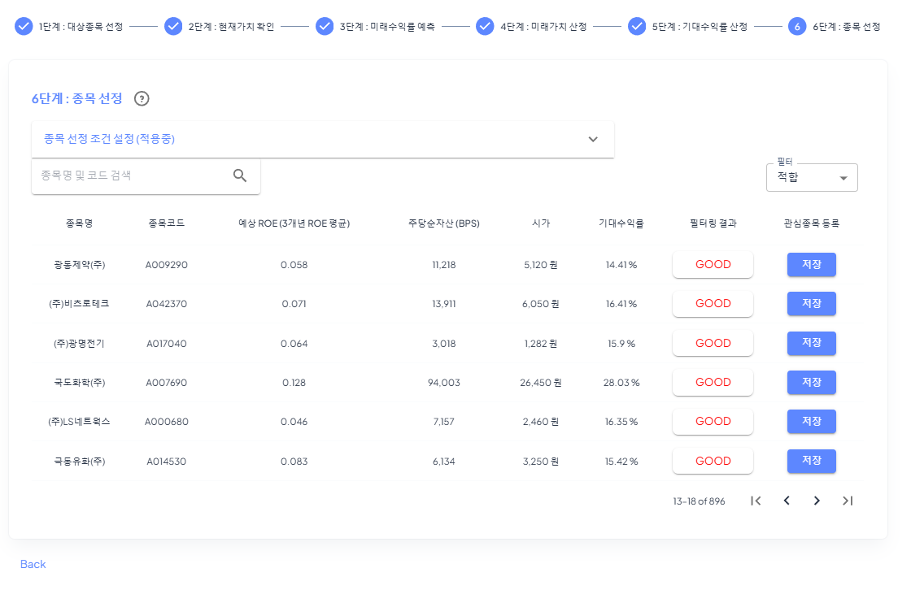
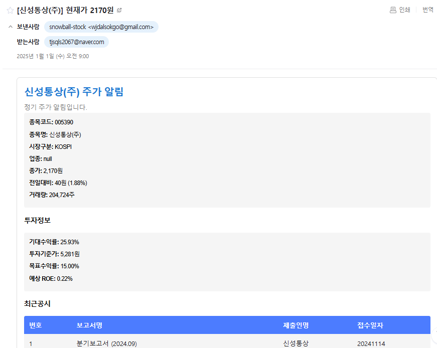

## 목차
- [📋 프로젝트 개요](#📋-프로젝트-개요)
- [🛠 기술 스택](#🛠-기술-스택)
- [⚙️ 핵심 기능 구현](#⚙️-핵심-기능-구현)
- [🖥️ 주요 화면](#🖥️-주요-화면)
- [🏗 시스템 아키텍처](#🏗-시스템-아키텍처)
- [📊 데이터베이스 설계](#📊-데이터베이스-설계)
- [🔍 트러블 슈팅](#🔍-트러블-슈팅)
- [📝 회고](#📝-회고)

## 📋 프로젝트 개요

  
  
  # Snowball Stock
  > 가치투자를 위한 기업 정보 제공 서비스 (개발 기간: 2.5개월)

### 🎯 핵심 기능
- 기업 재무정보 및 주가 정보 제공
- 관심 종목 등록 및 알림 서비스
- 기업 공시 정보 알림
- ROE 기반 기업 스크리닝 및 가치평가 시스템 구현

### 💡 프로젝트 특징
- 1인 풀스택 개발 (프론트엔드/백엔드/인프라)
- '눈덩이 주식투자' 도서 기반 가치투자 시스템 구현
- 자동화된 데이터 수집 및 모니터링 시스템

## 🛠 기술 스택

<table style="font-size: 0.8em;">
<tr>
<th>분류</th><th>기술 스택</th><th>설명</th>
</tr>
<tr>
<td><b>Frontend</b></td>
<td>
Next.js 13.4.3 
TypeScript 5.0.4 
MUI 5.x 
React 18.2.0 
Recoil 0.7.7 
Vercel
</td>
<td>
React 기반 SSR 프레임워크 
정적 타입 지원 
Material Design UI 라이브러리 
UI 라이브러리 
상태 관리 라이브러리 
웹 애플리케이션 배포 플랫폼
</td>
</tr>
<tr>
<td><b>Backend</b></td>
<td>
Java 17 
Spring Boot 3.2.2 
Spring Security 3.2.2 
JPA/Hibernate 
Redis 
Actuator 3.2.3
</td>
<td>
LTS 버전 
웹 애플리케이션 프레임워크 
인증/인가 처리 
ORM 프레임워크 
기업공시 데이터 인메모리 캐시 
애플리케이션 모니터링
</td>
</tr>
<tr>
<td><b>Infrastructure</b></td>
<td>
AWS EC2 t3.small 
AWS RDS MySQL 8.0 
AWS VPC 
AWS Route 53 
Docker 24.0.7 
Nginx 1.24.0 
Prometheus & Grafana
</td>
<td>
애플리케이션 서버 
MySQL 데이터베이스 
서브넷 분리된 네트워크 구성 
DNS 서비스 및 도메인 관리 
컨테이너 기반 배포 
API 캐싱, 리버스 프록시 
시스템 모니터링, Slack 알림
</td>
</tr>
</table>

## ⚙️ 핵심 기능 구현

### 1. 주가 정보 수집 및 제공
- KRX 웹사이트 크롤링으로 10분 간격 주가 데이터 수집
- 공공데이터 포털 API 연동으로 일 1회 상장/상폐 정보 갱신
- Nginx, Redis 캐싱으로 API 응답 속도 최적화

### 2. 기업 재무정보 분석
- 전자공시 DART API 활용한 재무제표 자동 수집
- ROE 기준 기업 가치평가(클라이언트 로직 구현)

### 3. 실시간 알림 서비스
- 스케줄러를 통한 `정기주가` & `목표주가` & `기업공시`  알림
- 알림 히스토리 조회 페이지 제공

## 🖥️ 주요 화면
### 주식 상장사 검색

  
  
종목명 또는 종목코드로 상장사를 검색하고 실시간 주가 정보를 확인할 수 있습니다.

  
  
검색된 기업의 상세 정보와 재무제표, 주요 투자 지표를 분석할 수 있습니다.

### 종목 스크리닝

  
  
ROE 기반으로 기업을 필터링하고 업종별로 기업을 비교 분석할 수 있습니다.

  
  
스크리닝된 기업들의 상세 재무지표를 확인하고 투자 가치를 분석할 수 있습니다.

### 알림 서비스

  
  
원하는 종목의 목표가를 설정하고 도달 시 실시간으로 알림을 받을 수 있습니다.

  
  
관심 있는 기업의 공시 정보를 유형별로 선택하여 구독할 수 있습니다.

  
  
설정한 알림은 이메일로도 전달되며, 상세 정보 링크를 통해 바로 확인할 수 있습니다.

### 관심 종목 및 알림 이력

  
  
자주 확인하는 종목을 관심 종목으로 등록하고 실시간으로 요약 정보를 모니터링할 수 있습니다.

  
  
발생한 알림의 이력을 조회하고 알림 설정별 발송 현황을 확인할 수 있습니다.

## 🏗 시스템 아키텍처
### 시스템 구성도

### 아키텍처 설계 의도

#### 🔒 보안 강화
- **네트워크 분리**
  - Public/Private 서브넷 분리로 보안 계층화
  - Private 서브넷의 RDB, Redis, 스케줄링 서버 보호
- **NAT 게이트웨이**
  - Private 서브넷의 안전한 외부 통신 지원
  - 내부 리소스 보호와 동시에 필요한 외부 통신 허용
- **안전한 SSH 접속**
  - AWS Instance Connect Endpoint 활용
  - Private 서브넷 EC2 인스턴스에 대한 보안적인 SSH 접속
  - Bastion 호스트 없이 안전한 원격 접속 구현

#### 🔄 가용성 확보
- **API 서버 이중화**
  - Active-Active 구성의 다중 서버 운영
  - IP Hash 기반 로드밸런싱으로 세션 일관성 보장
  - 동일 사용자의 요청을 동일 서버로 라우팅
- **모니터링 체계**
  - Prometheus & Grafana를 통한 실시간 시스템 모니터링
  - 장애 상황 조기 감지 및 대응

#### ⚡ 개발 효율성
- **프론트엔드 배포**
  - Vercel을 활용한 프론트엔드 배포 자동화
  - 백엔드 개발에 리소스 집중
- **컨테이너 관리**
  - GitHub Container Registry 활용
  - 도커 이미지 관리 비용 절감

## 📊 데이터베이스 설계
### ERD

  

## 모니터링 구축

## 🔍 트러블 슈팅
작성중

## 📝 회고
작성중