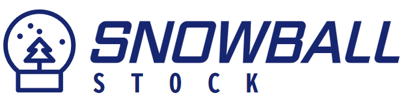

## 목차
- 프로젝트 개요
- 기술 스택
- 주요 기능 및 화면
- 시스템 아키텍처
- 데이터베이스 설계
- API 엔드포인트 목록
- 모니터링 구축
- 트러블 슈팅
- 회고

## 프로젝트 개요

  
  
  # Snowball Stock
  > 가치투자를 위한 기업 정보 제공 서비스 (개발 기간: 2.5개월)
  
  | 서비스 | URL | 테스트 계정 |
  |--------|-----|-------------|
  | 웹 서비스 | https://snowball-stock.vercel.app/ (Vercel)| ID: test123, PW: 123123 |
  | API | https://snowball-stock.site/api/v1 (Nginx)| same |
  | 모니터링 | http://snowball-stock.site:3000 (Grafana) | same |

### 핵심 기능
- 기업 재무정보 및 주가 정보 제공
- 관심 종목 등록 및 알림 서비스
- 기업 공시 정보 알림
- ROE 기반 기업 스크리닝 및 가치평가 시스템 구현

### 프로젝트 특징
- 1인 풀스택 개발 (프론트엔드/백엔드/인프라)
- ['눈덩이 주식투자'](https://www.yes24.com/Product/Goods/7498176?Acode=101) 도서 기반 가치투자 시스템 구현
- 자동화된 데이터 수집 및 모니터링 시스템

## 기술 스택

| 분야 | 세부 항목 |  |
|------|-----------|-----------|
| **Frontend** | • Next.js 13.4.3 • TypeScript 5.0.4 • React 18.2.0 | • MUI 5.x • Recoil 0.7.7 • Vercel |
| **Backend** | • Java 17 • Spring Boot 3.2.2 • JPA/Hibernate | • Spring Security 3.2.2 • Redis • Actuator 3.2.3 |
| **Infrastructure** | • AWS EC2 • AWS RDS MySQL 8.0 • Docker 24.0.7 • Node Exporter | • AWS VPC • AWS Route 53 • Nginx 1.24.0 • Prometheus & Grafana |

## 주요 기능 및 화면

### 1. 주가 정보 수집 및 기업 검색
- KRX 웹사이트 크롤링으로 10분 간격 주가 데이터 수집
- 공공데이터 포털 API 연동으로 일 1회 상장/상폐 정보 갱신
- Nginx, Redis 캐싱으로 API 응답 속도 최적화

  
  
종목명 또는 종목코드로 상장사를 검색하고 실시간 주가 정보 확인

  
  
  
검색된 기업의 재무제표 및 주요 투자 지표 제공

### 2. ROE 기반 기업 가치평가 시스템
- 전자공시 DART API를 활용한 재무제표 자동 수집
- ROE 기준 기업 가치평가 및 스크리닝 시스템 구현

  
  
ROE 기반의 가치평가를 통해 기업 필터링

  
  
  
스크리닝된 기업들의 상세 재무지표 확인 및 기대수익률 분석

### 3. 실시간 알림 서비스
- 스케줄러를 통한 `정기주가` & `목표주가` & `기업공시` 알림
- 이메일 알림 및 투자 부가정보 제공

  
  
목표가 설정 및 실시간 알림 서비스

  
  
  
기업별 맞춤 공시 정보 구독 설정

  
  
  
이메일 알림 및 상세 정보 바로가기 제공

### 4. 관심 종목 관리
- 관심 종목에 대한 목표수익률 & 예상 ROE 변경가능
- 알림 설정 현황 및 이력 관리

  
  
관심 종목 등록 및 투자지표 설정

  
  
  
알림 이력 조회 및 설정별 발송 현황 확인

## 시스템 아키텍처
### 시스템 구성도

### 아키텍처 설계 의도

#### 보안 강화
- **네트워크 분리**
  - Public/Private 서브넷 분리로 보안 계층화
  - Private 서브넷의 RDB, Redis, 스케줄링 서버 보호
- **NAT 게이트웨이**
  - Private 서브넷의 안전한 외부 통신 지원
  - 내부 리소스 보호와 동시에 필요한 외부 통신 허용
- **안전한 SSH 접속**
  - AWS Instance Connect Endpoint 활용
  - Private 서브넷 EC2 인스턴스에 대한 보안적인 SSH 접속
  - Bastion 호스트 없이 안전한 원격 접속 구현

#### 가용성 확보
- **API 서버 이중화**
  - Active-Active 구성의 다중 서버 운영
  - IP Hash 기반 로드밸런싱으로 세션 일관성 보장
  - 동일 사용자의 요청을 동일 서버로 라우팅
- **모니터링 체계**
  - Prometheus & Grafana를 통한 실시간 시스템 모니터링
  - 장애 상황 조기 감지 및 대응

#### 개발 효율성
- **프론트엔드 배포**
  - Vercel을 활용한 프론트엔드 배포 자동화
  - 백엔드 개발에 리소스 집중
- **컨테이너 관리**
  - GitHub Container Registry 활용
  - 도커 이미지 관리 비용 절감

## 데이터베이스 설계
### ERD

  

## API 엔드포인트 목록

> Base URL: `/api/v1`

인증 (Authentication)

| Method | Endpoint | 설명 |
|--------|----------|------|
| POST | `/auth/login` | 로그인 |
| POST | `/auth/logout` | 로그아웃 |
| POST | `/auth/register` | 회원가입 |
| POST | `/auth/auto-login` | 자동 로그인 |

알림 (Notification)

| Method | Endpoint | 설명 |
|--------|----------|------|
| GET | `/alarms/target-prices` | 목표가 포착 알람 조회 |
| GET | `/alarms/prices` | 정기 주가 알람 조회 |
| GET | `/alarms/reports` | 신규 공시 구독 현황 조회 |
| GET | `/notifications` | 알림 이력 전체 조회 |
| DELETE | `/notifications/{notificationId}` | 특정 알림 삭제 |

재무 정보 (Finance)

| Method | Endpoint | 설명 |
|--------|----------|------|
| GET | `/finances/screening` | 스크리닝 데이터 조회 |
| GET | `/finances/stocks` | 기업 정보 및 주가 조회 |
| GET | `/finances/{corpCode}` | 단일 기업 재무정보 조회 |
| GET | `/finances/{corpCode}/reports` | 단일 기업 공시 조회 |

사용자 관리 (User)

| Method | Endpoint | 설명 |
|--------|----------|------|
| PUT | `/users/{userId}/password` | 비밀번호 수정 |
| PUT | `/users/{userId}/email` | 이메일 수정 |

관심 종목 (Saved Corp)

| Method | Endpoint | 설명 |
|--------|----------|------|
| GET | `/users/{userId}/saved-corps` | 관심 종목 조회 |
| POST | `/users/{userId}/saved-corps/{corpCode}` | 관심 종목 저장 |
| PUT | `/users/{userId}/saved-corps/{corpCode}` | 관심 종목 정보 수정 |
| DELETE | `/users/{userId}/saved-corps/{corpCode}` | 관심 종목 삭제 |

메모 (Memo)

| Method | Endpoint | 설명 |
|--------|----------|------|
| POST | `/memos` | 메모 생성 |
| PUT | `/memos/{memoId}` | 메모 수정 |
| DELETE | `/memos/{memoId}` | 메모 삭제 |

## 모니터링 구축
### 모니터링 화면

## 트러블 슈팅
작성중

## 회고
작성중